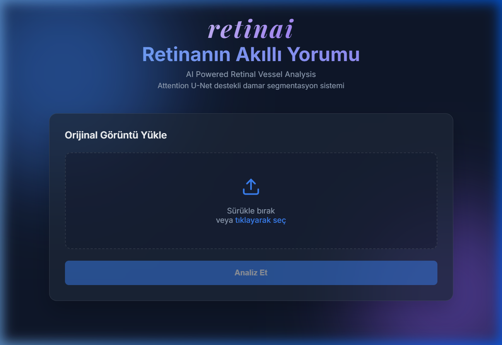
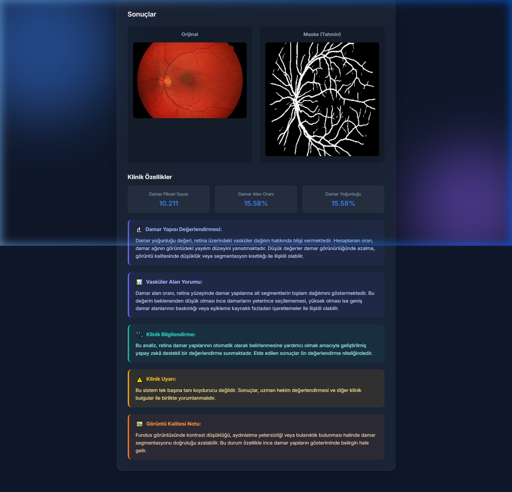

# 🔬 RetinAI — Retinal Damar Segmentasyon Sistemi

> **Attention U-Net** tabanlı, uçtan uca retinal damar segmentasyonu ve klinik özellik çıkarımı yapan web uygulaması.

### 💻 Arayüzden Görüntüler



---


## 📌 Proje Hakkında

Bu proje, göz fundus görüntülerindeki retinal damarları otomatik olarak segmente eden ve klinik özellikler çıkaran bir yapay zeka sistemidir. Kullanıcı bir fundus görüntüsü yüklediğinde sistem:

1. Görüntüyü **Attention U-Net** modeliyle işler
2. Damar segmentasyon maskesini üretir
3. **Damar piksel sayısı**, **alan oranı** ve **damar yoğunluğu** gibi klinik özellikleri hesaplar
4. Sonuçları web arayüzünde görsel olarak sunar

---

## 🏗️ Proje Yapısı

```
retina_project/
├── src/                          # Model eğitim ve değerlendirme kodları
│   ├── model.py                  # UNet, AttentionUNet, ResUNet, SegFormerLite, SwinUNet
│   ├── train.py                  # UNet eğitim döngüsü
│   ├── train_attention_standalone.py  # Attention U-Net eğitimi (CSV loglu)
│   ├── train_resunet.py          # ResUNet eğitimi
│   ├── train_segformer.py        # SegFormer eğitimi
│   ├── train_swinunet.py         # Swin-UNet eğitimi
│   ├── train_compare.py          # UNet vs AttentionUNet karşılaştırmalı eğitim
│   ├── evaluate.py               # Test seti değerlendirmesi (5 model, Dice, IoU vb.)
│   ├── plot_multi_compare.py     # 5 model karşılaştırma grafikleri
│   ├── clinical_features.py      # Klinik özellik çıkarımı ve CSV üretimi
│   ├── visualize.py              # Tahmin görselleştirme
│   ├── dataset.py                # Dataset sınıfı
│   ├── utils.py                  # Loss fonksiyonları, metrikler, yardımcı araçlar
│   └── split_test.py             # Test/train/val bölme scripti
│
├── retina_system/                # Web uygulaması (Full-Stack)
│   ├── backend/                  # FastAPI sunucu
│   │   ├── main.py               # Uygulama giriş noktası
│   │   ├── routers/predict.py    # /api/predict endpointi
│   │   ├── services/model_service.py  # Inference servisi
│   │   └── core/config.py        # Konfigürasyon (model yolu, eşik vb.)
│   ├── frontend/public/          # Statik web arayüzü
│   │   ├── index.html            # Ana sayfa (RetinAI web UI)
│   │   ├── style.css             # Glassmorphism tasarım sistemi
│   │   └── script.js             # Görüntü yükleme ve analiz akışı
│   ├── models/                   # Eğitilmiş model ağırlıkları (.pth)
│   └── run.bat                   # Tek tıkla başlatma scripti (Windows)
│
├── data/                         # Veri seti (paylaşılmaz, .gitignore)
└── results/                      # Değerlendirme sonuçları, CSV çıktıları
```

---

## 🤖 Model Mimarileri

Projede **5 farklı segmentasyon mimarisi** karşılaştırmalı olarak eğitilmiş ve değerlendirilmiştir:

| Model | Tür | Parametre | Açıklama |
|---|---|---|---|
| **UNet** | CNN | 31.0M | Klasik encoder-decoder mimarisi |
| **Attention U-Net** | CNN | 34.9M | UNet + Attention Gate ile ince damar odağı |
| **ResUNet** | CNN | 32.4M | Residual (artık) bağlantılı U-Net |
| **SegFormer Lite** | Transformer | 1.3M | MiT-inspired DWSConv + MLP decoder |
| **Swin-UNet** | Transformer | 34.5M | Swin Transformer encoder + CNN decoder |

### Attention U-Net
Standart U-Net'e **Attention Gate** ekler. Decoder'daki her skip connection, encoder'dan gelen özellik haritasını dikkat mekanizmasıyla ağırlıklandırarak damar gibi ince yapılara odaklanmayı iyileştirir.

```
Encoder (Down) → Bottleneck → Decoder (Up)
                                  ↑
                           AttentionGate
                          (skip × alpha)
```

### Loss Fonksiyonu
`BCEWithLogitsLoss` + `DiceLoss` kombinasyonu kullanılmıştır. Damar pikselleri az olduğundan sınıf dengesizliğini gidermek için `pos_weight=5.0` uygulanmıştır.

### Değerlendirme Metrikleri
| Metrik | Açıklama |
|---|---|
| **Dice** | Ana segmentasyon başarım ölçütü |
| **IoU** | Kesişim / Birleşim oranı |
| **Precision / Recall** | Kesinlik ve duyarlılık |
| **Sensitivity / Specificity** | Klinik doğruluk metrikleri |

---

## 🚀 Kurulum ve Çalıştırma

### Gereksinimler
```bash
pip install -r requirements.txt
```

Ana bağımlılıklar: `torch`, `torchvision`, `fastapi`, `uvicorn`, `opencv-python`, `Pillow`, `numpy`

### Web Uygulamasını Başlatma (Windows)

```bash
cd retina_system
run.bat
```

veya manuel olarak:

```bash
cd retina_system/backend
uvicorn main:app --reload --port 8000
```

Tarayıcıda aç: [http://localhost:8000](http://localhost:8000)

> ⚠️ Çalıştırmadan önce `retina_system/models/` klasörüne eğitilmiş model ağırlığını (`attention_unet_best.pth`) yerleştirin.

### Model Eğitimi

```bash
# Attention U-Net eğitimi
python src/train_attention.py

# Her iki modeli karşılaştırmalı eğitme
python src/train_compare.py
```

### Değerlendirme ve Klinik Özellik Çıkarımı

```bash
# Test seti değerlendirmesi
python src/evaluate.py

# Klinik özellik CSV üretimi
$env:PYTHONUTF8=1; python src/clinical_features.py
```

---

## 🌐 API Kullanımı

`POST /api/predict` — Görüntü yükle, segmentasyon al

```json
// İstek: multipart/form-data — "file" alanı
// Yanıt:
{
  "mask_base64": "<base64 PNG>",
  "vessel_pixel_count": 4821,
  "vessel_area_ratio": 0.0736,
  "vessel_density": 0.0736
}
```

---

## 📊 Veri Seti

Bu çalışmada kullanılan retina görüntüleri, 4–83 yaş aralığındaki bireyleri kapsayan ve retina damar segmentasyonu alanında yaygın olarak kullanılan açık erişimli veri setlerinden elde edilmiştir. Veri seti oluşturulurken aşağıdaki veri tabanlarından yararlanılmıştır:

- **DRIVE** (Digital Retinal Images for Vessel Extraction)
- **STARE** (Structured Analysis of the Retina)
- **CHASEDB1** (Child Heart and Health Study in England Database)
- **FIVES** (Fundus Image Vessel Segmentation)

Bu veri setleri, retina damarlarının otomatik tespiti ve segmentasyonu üzerine gerçekleştirilen akademik çalışmalarda sıklıkla kullanılan ve referans niteliği taşıyan veri kaynaklarıdır.

### Görüntü Özellikleri
- **600 renkli retina fundus görüntüsü** + **600 manuel damar segmentasyon maskesi**
- 565×584 piksel çözünürlük
- Eğitim öncesinde **CLAHE** (Contrast Limited Adaptive Histogram Equalization) ile kontras artırma uygulanmıştır

### Veri Bölünmesi

| Set | Görüntü Sayısı | Maske Sayısı | Kullanım |
|---|---|---|---|
| **Eğitim (Train)** | ~380 | ~380 | Model ağırlıklarının öğrenilmesi |
| **Doğrulama (Validation)** | ~100 | ~100 | Eğitim sırasında overfitting kontrolü |
| **Test** | ~120 | ~120 | Nihai model performans değerlendirmesi |

---

## 🛠️ Teknoloji Yığını

| Katman | Teknoloji |
|---|---|
| **Derin Öğrenme** | PyTorch |
| **Backend API** | FastAPI + Uvicorn |
| **Frontend** | Vanilla HTML / CSS / JavaScript |
| **Görüntü İşleme** | OpenCV, Pillow |
| **Veri Analizi** | NumPy, CSV |

---

## 👩‍💻 Geliştirici

**Münteha Dincar**
retinai Fundus Görüntülerinde Damar Segmentasyonu — Tıp Mühendisliği Bitirme Projesi 2026
